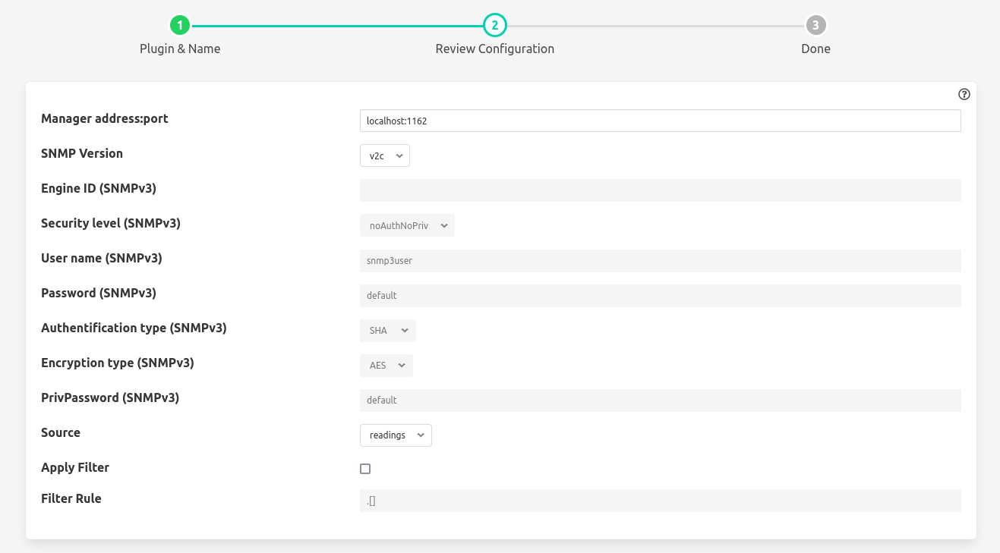

# fledge-north-snmp

The ability to monitor the gateway in real time is a key feature for any organization that manages a power system telecontrol network. This feature is part of the supervision and incident management system.
Simple Network Management Protocol (SNMP) is an application–layer protocol defined by the Internet Architecture Board (IAB) in RFC1157 for exchanging management information between network devices.
SNMP is one of the widely accepted network protocols to manage and monitor network elements. Most of the professional–grade network elements come with bundled SNMP agent. These agents have to be enabled and configured to communicate with the network monitoring tools or network management system (NMS).

SNMP agent north plugin converts the collected data stream to SNMP notifications (traps or informs) and send them to the remote SNMP manager (server).

With this plugin, you can send the following measurements to your SNMP manager:
- CPU Usage
- Host name
- Load Average
- Memory Usage
- Paging and swapping
- Process information
- System Uptime


## Installation

1) Copy the python/fledge/plugins/north/snmp directory to /usr/local/fledge/python/fledge/python/plugins/north/
2) You need snmp installed so run:

```bash
$ sudo apt install -y snmp
```

3) You also need to install the south plugin systeminfo. See: https://github.com/fledge-iot/fledge-south-systeminfo

## Testing

To create a north service with the snmp plugin:
 - Click on *North* in the left hand menu bar 
 - Select *snmp* from the plugin list
 - Name your service and click *Next*
 - Configure the plugin:
 
    - Add the manager address (@IP:port) that will receive the traps
    - Choose the SNMP version you want to use
    - If using SNMPv3: you need to add the Engine ID, Security level, User name, Password, Authentification type, Encryption type, PrivPassword
 - Click *Next*
 - Enable the service and click *Done*. Do not forget to also run the south plugin systeminfo or no traps will be sent.